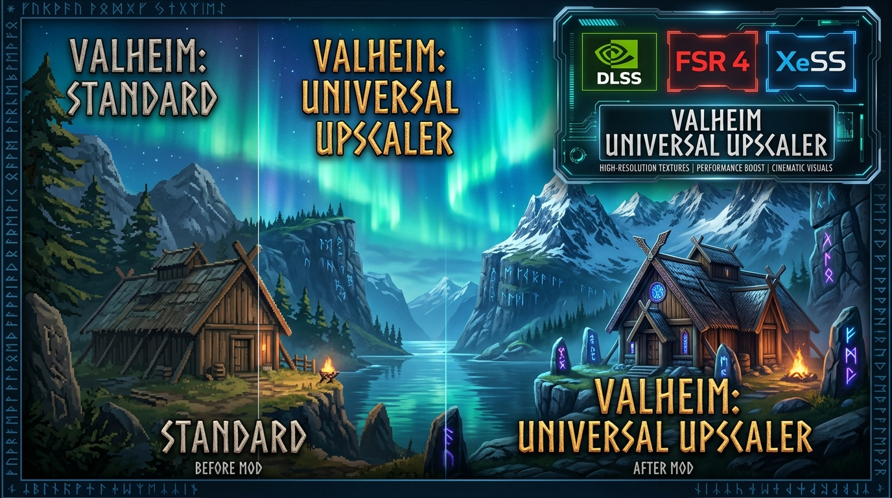

# Valheim Universal Upscaler GUI

<p align="center">
  
</p>

<p align="center">
  
  
  
  
  
</p>

---

## 🇬🇧 English

### Overview
**Valheim Universal Upscaler GUI** is a full-featured in-game settings integration mod for Valheim that adds native UI controls directly inside **Settings ➔ Graphics** to configure modern upscaling technologies (AMD FSR 3.1, AMD FSR 4, Intel XeSS, NVIDIA DLSS), quality presets, frame generation, and sharpness on the fly.

No more tweaking `.ini` files or struggling with external overlays! Everything is seamlessly integrated into Valheim's graphics menu and accessible via an in-game hotkey HUD (**F7**).

### Key Features
* **Native In-Game Graphics Menu**:
  * **Render Scale / Quality Presets**:
    * `Off` (100% Native game rendering)
    * `Native (DLAA / FSR Native AA)` (Ultra-sharp anti-aliasing at native resolution)
    * `Quality` (67% render scale — optimal balance of performance and visual fidelity)
    * `Balanced` (58% render scale)
    * `Performance` (50% render scale)
    * `Ultra Performance` (33% render scale)
  * **Upscaling Technology (Backend)**:
    * `AMD FSR 3.1`
    * `AMD FSR 4 (RDNA4 / FP8 Hardware Accelerated)` — recommended for AMD Radeon RX 9070 XT / RX 9000 series!
    * `Intel XeSS`
    * `NVIDIA DLSS`
  * **Frame Generation**: One-click toggle for FSR / OptiFG frame generation.
  * **Sharpness**: Smooth slider from `0%` to `100%`.
* **In-Game Quick Overlay (`F7`)**:
  * Press **`F7`** anywhere in-game to toggle a floating quick-access HUD.
* **100% Standalone r2modman Integration**:
  * **Zero manual file copying!** All upscaler runtimes (OptiScaler, FSR 4, XeSS) are bundled right inside and auto-deployed by the preloader on first launch.
  * Fully compatible with **r2modman**, **Thunderstore Mod Manager**, and standard Steam installations.

---

### ⚡ Quick Start & Installation

> [!IMPORTANT]
> **DirectX 12 Requirement**: Valheim runs in DirectX 11 by default. Modern upscalers (FSR, XeSS, DLSS) require DirectX 12.
> In your Steam Library, right-click **Valheim ➔ Properties ➔ General ➔ Launch Options** and enter:
> ```text
> -force-d3d12
> ```

#### 📦 Option 1: Via r2modman / Thunderstore Mod Manager (1-Click, Recommended)
**No manual file copying required!** All upscaler runtimes (OptiScaler, FSR 4, XeSS) are bundled directly inside this package and auto-deployed upon launch:
1. In **r2modman**, search for **`Valheim_Universal_Upscaler_GUI`** and click **Download** (dependencies will be installed automatically).
2. Ensure `-force-d3d12` is set in your Steam Launch Options for Valheim.
3. Click the blue **Start Modded** button in r2modman.
4. That's it! Open **Settings ➔ Graphics** or press **F7** in-game to configure your upscaler.

#### 🚀 Option 2: Manual Installation (Without Mod Manager)
1. Download **`Valheim_Universal_Upscaler_Full_Setup_v1.0.0.zip`** from [GitHub Releases](https://github.com/Roskud/Valheim-Universal-Upscaler-GUI/releases).
2. Extract the contents directly into your `Valheim` game directory (`steamapps\common\Valheim`).
3. Add `-force-d3d12` to Valheim's Steam Launch Options.
4. Launch Valheim via Steam.

---

## 🇷🇺 Русский

### Описание
**Valheim Universal Upscaler GUI** — это полноценный внутриигровой интерфейс для настройки апскейлинга нового поколения в Valheim. Мод добавляет официальные выпадающие списки и настройки прямо в раздел **«Настройки» ➔ «Графика»**, позволяя на лету управлять технологиями (AMD FSR 3.1, AMD FSR 4, Intel XeSS, NVIDIA DLSS), пресетами качества, генерацией кадров и резкостью.

Больше не нужно вручную редактировать конфигурационные файлы — все параметры доступны прямо в меню игры и через быстрый оверлей по горячей клавише (**F7**)!

### Основные возможности
* **Интеграция в настройки графики Valheim**:
  * **Пресеты качества масштабирования**:
    * `Выключено` (Стандартный нативный рендеринг)
    * `Нативное (DLAA / FSR Native)` (Максимальное качество сглаживания)
    * `Качество (Quality — 67%)` (Идеальный баланс высокого FPS и чёткости)
    * `Баланс (Balanced — 58%)`
    * `Быстродействие (Performance — 50%)`
    * `Ультра быстродействие (33%)`
  * **Технология апскейла (Backend)**:
    * `AMD FSR 3.1`
    * `AMD FSR 4 (RDNA4 / FP8)` — идеальный выбор для видеокарт AMD Radeon RX 9070 XT / RX 9000!
    * `Intel XeSS`
    * `NVIDIA DLSS`
  * **Генерация кадров (Frame Generation)**: Мгновенное включение/отключение OptiFG / FSR 3.1 FG.
  * **Резкость (Sharpness)**: Ползунок от `0%` до `100%`.
* **Быстрое оверлей-меню (`F7`)**:
  * Нажмите клавишу **`F7`** во время игры, чтобы открыть плавающую панель быстрых настроек.
* **100% Автономная работа в r2modman**:
  * **Никаких ручных манипуляций!** Все библиотеки апскейла (OptiScaler, FSR 4, XeSS) уже упакованы внутрь мода и автоматически устанавливаются предзагрузчиком при первом запуске игры.
  * Поддерживает запуск через **r2modman**, **Thunderstore**, а также чистый Steam.

---

### ⚡ Быстрая установка

> [!IMPORTANT]
> **Обязательно для DirectX 12**: Valheim по умолчанию запускается в режиме DirectX 11. Современным апскейлерам (FSR, XeSS, DLSS) необходим DirectX 12.
> В библиотеке Steam нажмите правой кнопкой на **Valheim ➔ Свойства ➔ Общие ➔ Параметры запуска** и впишите:
> ```text
> -force-d3d12
> ```

#### 📦 Вариант 1: Установка через r2modman / Thunderstore (В 1 клик, Рекомендуется)
**Вам не нужно ничего копировать или искать вручную!** Все библиотеки апскейлинга (OptiScaler, FSR 4, XeSS) уже встроены в мод и автоматически разворачиваются при первом запуске:
1. В **r2modman** найдите **`Valheim_Universal_Upscaler_GUI`** и нажмите **Download** (нужные зависимости, включая BepInExPack, установятся сами).
2. Убедитесь, что в параметрах запуска Steam прописан `-force-d3d12`.
3. Нажмите синюю кнопку **Start Modded** в r2modman.
4. Всё готово! Откройте **Настройки ➔ Графика** или нажмите **F7** прямо во время игры для вызова оверлея.

#### 🚀 Вариант 2: Ручная установка (Без менеджера модов)
1. Скачайте архив **`Valheim_Universal_Upscaler_Full_Setup_v1.0.0.zip`** из [Релизов GitHub](https://github.com/Roskud/Valheim-Universal-Upscaler-GUI/releases).
2. Распакуйте все файлы в корневую папку игры `Valheim` (`steamapps\common\Valheim`).
3. В параметрах запуска Steam укажите `-force-d3d12`.
4. Запустите Valheim через Steam.

---

## 📜 Credits & License
* Developed by **Roskud**.
* Powered by [BepInEx](https://github.com/BepInEx/BepInEx) and [HarmonyX](https://github.com/BepInEx/HarmonyX).
* Works in synergy with [OptiScaler](https://github.com/cdozdil/OptiScaler).
